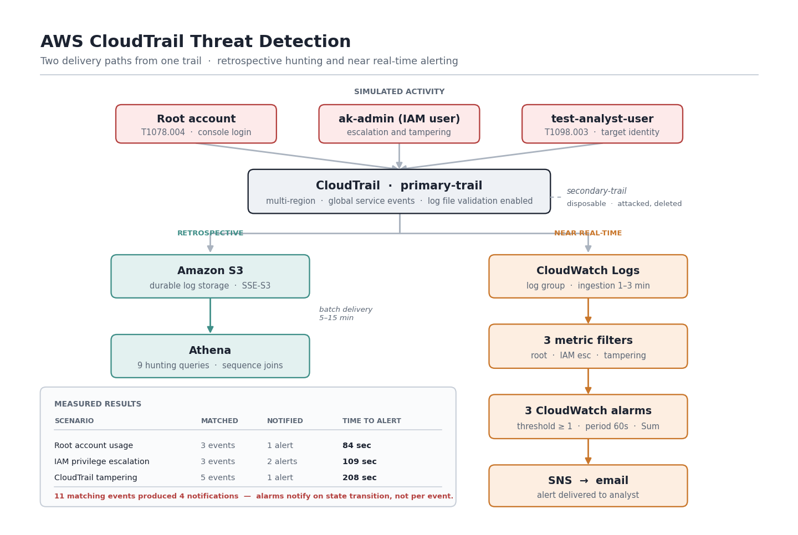

# AWS CloudTrail Threat Detection

Built three CloudTrail detections, attacked my own AWS account to test them, investigated the result from logs alone, and documented what the detections missed.

All three fired. Time to alert ranged from 84 to 208 seconds. The most useful finding was a gap: **11 matching events produced only 4 notifications**, because CloudWatch alarms notify on state transition rather than per event. A CloudTrail trail was deleted while the responsible alarm sat in ALARM state and sent nothing.

Every claim in this repository is backed by a CloudTrail `eventID`.

---

## Results

| Scenario | MITRE | Detected | Matching events | Notifications | Time to alert |
|---|---|---|---|---|---|
| Root account usage | T1078.004 | Yes | 3 | 1 | **84 sec** |
| IAM privilege escalation | T1098.001 / T1098.003 | Yes | 3 | 2 | **109 sec** |
| CloudTrail tampering | T1685.002 | Yes | 5 | 1 | **208 sec** |

**Detection coverage:** 3 of 3 scenarios
**False positives observed:** 1 (deliberately generated as a control case)
**Time to full eradication:** 94 seconds, response actions logged
**Log integrity verified:** 25/25 digest files, 156/156 log files valid

---

## Architecture



Two delivery paths from one trail, for two different jobs:

- **S3 → Athena** — durable retention and retrospective hunting. Batch delivery, 5–15 minute lag.
- **CloudWatch Logs → metric filter → alarm → SNS** — near real-time alerting. This is the path that makes detection possible; a trail delivering only to S3 cannot trigger anything.

A second disposable trail (`secondary-trail`) existed solely so log tampering could be simulated without losing visibility. `primary-trail` recorded its destruction, including the `DeleteTrail` call itself.

---

## What's in here

```
detections/
├── sigma/          3 Sigma rules, portable detection logic
├── cloudwatch/     deployed metric filter and alarm config, with validation results
└── athena/         9 hunting queries, including sequence detection metric filters can't express

investigation/
├── investigation-report.md    full incident investigation from logs alone
└── ground-truth.md            what was actually done, for comparison

docs/
├── mitre-attack-mapping.md            techniques derived from evidence, with verification notes
├── detection-coverage-assessment.md   severity-ranked gaps and remediation priority
├── lessons-learned.md                 technical and operational findings
└── teardown.md                        decommission checklist

evidence/       raw CloudTrail exports and validation output
screenshots/    26 captures, numbered in narrative order
```

---

## The three detections

### 1. Root account usage — T1078.004

```
{ $.userIdentity.type = "Root"
  && $.userIdentity.invokedBy NOT EXISTS
  && $.eventType != "AwsServiceEvent" }
```

An **identity** rule — it doesn't care what was done, only who did it.

The two exclusions exist because of a baseline finding: AWS itself calls into the account with `userAgent: "AWS Internal"` and would otherwise have been the first false positive. A rule is defined as much by what it excludes as by what it matches.

Validated: fired on eventID `3aa8e2da` in 84 seconds.

### 2. IAM privilege escalation — T1098.001, T1098.003

Matches eleven IAM API calls that grant privilege or credentials. An **action** rule — the identity is legitimate, the specific call is what matters.

This rule produced the project's central finding. Two `AttachUserPolicy` events, 76 seconds apart, same identity, same source IP, same session:

```
eventID aa8026e4   policyArn: .../ReadOnlyAccess    → informational
eventID f235ea6b   policyArn: .../IAMFullAccess     → critical
```

Identical in every field except `requestParameters.policyArn`.

**Severity lives in the target of the action, not the event name.** A rule keyed on `eventName` alone cannot separate routine administration from privilege escalation. The Athena version encodes this; the metric filter cannot.

### 3. CloudTrail tampering — T1685.002

```
{ ($.eventName = "StopLogging") || ($.eventName = "DeleteTrail")
  || ($.eventName = "UpdateTrail") || ($.eventName = "PutEventSelectors")
  || ($.eventName = "StartLogging") }
```

A **behavioural** rule. `StartLogging` is included deliberately: it is benign alone and routine during maintenance, but `StopLogging` → `StartLogging` from one identity minutes apart creates a bounded gap in the record and then restores normal appearance.

Observed: `3c596c6d` at 06:06:01, `34c51c39` at 06:09:20 — same session, 3 min 19 sec apart.

Metric filters evaluate one event at a time, so the pattern is invisible to the deployed rule. Query 4 in `detections/athena/hunting-queries.sql` expresses it as a self-join. That gap is the concrete argument for a correlation engine.

---

## Detection validation

Every rule was tested in both directions — it fired on the simulated attack, and its behaviour on benign activity was recorded rather than assumed.

**True positives:** all three scenarios detected, eventIDs recorded per rule in `detections/sigma/`.

**False positive:** `AttachUserPolicy` with `ReadOnlyAccess` (eventID `aa8026e4`) triggered the IAM alarm. This is legitimate administrative work and it was generated deliberately as a control case. It is documented rather than tuned away, because tuning to admin-level policy ARNs only would reduce noise at the cost of missing an attacker granting a narrow but dangerous permission. That trade-off is chosen, not solved.

**Measured limitation:** across all three scenarios, 11 matching events produced 4 notifications. In the tampering test one alert was delivered at 06:09:29; the trail was then modified twice and deleted at 06:12:03 with no further notification, and the alarm did not return to OK until 06:14:29 — after the trail was already gone.

The detection logic was correct throughout. The delivery mechanism was the failure.

---

## Investigation

The incident was reconstructed from CloudTrail alone before consulting the record of what was actually done.

**680 events in the window. Eleven were state-changing.** Filtering on `readOnly: false` removed 98% of the noise. A single console page load generates roughly 15 API calls across services never opened; a two-minute root browsing session produced 127 events, all read-only.

**Attack path:**

```
Root ConsoleLogin (MFA)  →  Discovery  →  CreateUser  →  AttachUserPolicy (IAMFullAccess)
  →  CreateAccessKey  →  StopLogging  →  StartLogging  →  UpdateTrail ×2  →  DeleteTrail
```

**Session correlation:** `sessionContext.creationDate` of `2026-09-03T04:50:01Z` appears on 679 of 680 events. The IAM escalation and the CloudTrail destruction — 34 minutes apart, different services — came from one console login. Pivoting on the credential rather than the username groups activity into sessions and survives an attacker changing networks.

**A finding about the method itself:** the first timeline pivoted on username and returned zero root events, because root activity carries no `userName` field at all. The root login was recovered only by searching on event name. The choice of pivot defines the blind spot.

**The honest limit:** every event was MFA-authenticated, from the account's habitual source IP, within one legitimate session. There is no technical indicator of compromise anywhere in the data. Had the identity been an adversary holding valid stolen credentials, the log record would be byte-identical. CloudTrail establishes *what* happened and *which identity* did it with certainty; it cannot establish whether that identity was authorized.

Full detail: [`investigation/investigation-report.md`](investigation/investigation-report.md)

---

## Response

Containment and eradication were performed rather than described, so that the response itself would be logged.

| Time (UTC) | Action | Phase |
|---|---|---|
| 06:33:44 | `UpdateAccessKey` → Inactive | Containment |
| 06:34:13 | `DetachUserPolicy` — IAMFullAccess | Eradication |
| 06:34:20 | `DetachUserPolicy` — ReadOnlyAccess | Eradication |
| 06:34:58 | `DeleteAccessKey` | Eradication |
| 06:35:18 | `DeleteUser` | Eradication |

Full eradication in 94 seconds, all five actions recorded by CloudTrail.

The key was deactivated **before** permissions were detached. Reversing that order leaves a window where the credential still works with elevated privilege. Note that for a role rather than an IAM user this would be insufficient — `ASIA` session credentials already issued remain valid until expiry, requiring session revocation rather than key deactivation.

**Recovery:** log integrity verified with `aws cloudtrail validate-logs` — 25/25 digest files and 156/156 log files valid across the incident date. Nothing was altered.

---

## Coverage gaps

Ten gaps identified. The most serious is architectural rather than a missing rule.

| Severity | Gap |
|---|---|
| **Critical** | Alarms notify on state change, not per event — 11 events produced 4 notifications |
| High | S3 log-bucket tampering not covered (`PutBucketPolicy` events `5bfa1454`, `240b1b5e` matched nothing) |
| High | Metric filters cannot correlate across events |
| High | Logs stored in the account they audit |
| Medium | Console logins recorded in the sign-in region, not the working region |
| Medium | No failed-authentication threshold |
| Medium | S3 data events disabled — object-level access invisible |
| Medium | No network-layer telemetry |
| Low | `CreateUser` not covered by the IAM rule |
| Low | No threat-intel enrichment |

**Tactics with no coverage at all:** Collection and Exfiltration. Both depend on S3 data events and VPC Flow Logs, neither enabled. An intrusion continuing past the observed stage would not be visible.

Full analysis with remediation priority: [`docs/detection-coverage-assessment.md`](docs/detection-coverage-assessment.md)

---

## Selected findings

**A single console page load generates ~15 API calls** across services never opened, including calls from AWS itself with `userAgent: "AWS Internal"`. Any detection keyed on volume of activity fails immediately in cloud.

**`readOnly` is the primary noise filter.** 680 events reduced to 11.

**Access key prefix determines the containment path.** `AKIA` is a long-term IAM user key — no expiry, not subject to MFA. `ASIA` is a temporary STS credential. Deactivating the key an `ASIA` credential derives from does not invalidate sessions already issued. Consequently, MFA protects the console path and does nothing for a leaked long-term key.

**Console sign-in events are written to the sign-in region.** The root `ConsoleLogin` was recorded in `us-east-2`, not the account's working region, because that region's endpoint served the request. This is distinct from global service events (IAM, STS), which consistently land in `us-east-1`. A single-region trail would not have captured it.

**`userAgent` is attacker-controlled** and can be set to anything. `sessionCredentialFromConsole` is set by AWS and is the more reliable indicator of console origin.

**ATT&CK identifiers change between versions.** T1562.008 was renumbered to T1685.002, and the Defense Evasion tactic was split into Stealth and Defense Impairment. Separately, `DeleteTrail` was initially mapped to T1070 (Indicator Removal) — invalid, because T1070 does not list IaaS among its platforms. Both errors were found by checking attack.mitre.org rather than working from memory.

Full list: [`docs/lessons-learned.md`](docs/lessons-learned.md)

---

## Reproducing this

**Setup (four settings that cannot be applied retroactively):**

1. Multi-region trail with global service events enabled
2. **Log file validation enabled at trail creation** — digests are only produced for logs delivered afterward
3. CloudWatch Logs integration — required for any alerting
4. A second disposable trail, so tampering can be simulated without losing visibility

**Deploy the detections:** patterns in `detections/cloudwatch/metric-filters.json`, applied as CloudWatch metric filters on the trail's log group, each with an alarm at threshold ≥1, period 60s, statistic Sum, and `TreatMissingData: notBreaching`. Security events are rare, so without that last setting alarms sit in `INSUFFICIENT_DATA` and appear broken.

**Test:** generate each scenario, record the time of each action, and compare against alarm state-change times. Alert arrival time is not event time — CloudWatch Logs ingestion lag ranged from ~1 to ~3.5 minutes and in one case made an alert appear to correspond to the wrong action.

**Cost:** under $1 total. Management events are free for the first trail copy; the second copy bills at roughly $2 per 100,000 events. SSE-KMS was deliberately disabled to avoid a $1/month key charge. GuardDuty, AWS Config, and S3 data events were not enabled. Teardown checklist in [`docs/teardown.md`](docs/teardown.md).

---

## Limitations

- Single AWS account. No Organizations, no SCP guardrails, no dedicated log archive account.
- Logs protected by file validation only — no S3 Object Lock or cross-account isolation.
- Data events not enabled, so object-level activity is not captured anywhere.
- Detections tested against synthetic activity in a low-volume account. False positive rates are not representative of production.
- No SIEM ingestion. Detections run natively in CloudWatch rather than a correlation platform.
- Single-analyst lab. No on-call rotation, ticketing, or escalation path was exercised.
- All activity was self-generated in an account owned and operated solely by the author.

## Future work

- Migrate notification from CloudWatch alarms to EventBridge rules for per-event delivery — the highest-priority fix identified
- Ingest the Sigma rules into a SIEM to enable sequence correlation
- Multi-account architecture with a dedicated log archive account and S3 Object Lock
- Enable S3 data events scoped to the log bucket
- Correlate GuardDuty findings against the CloudTrail timeline
- Deploy the whole build as Terraform

---

## Disclaimer

This project was performed in a controlled AWS laboratory environment owned and operated solely by the author, for security learning and detection development. All "attack" activity was simulated adversary emulation performed by the account owner against their own resources. Account identifiers, IP addresses, and credential identifiers have been redacted from published artifacts.
