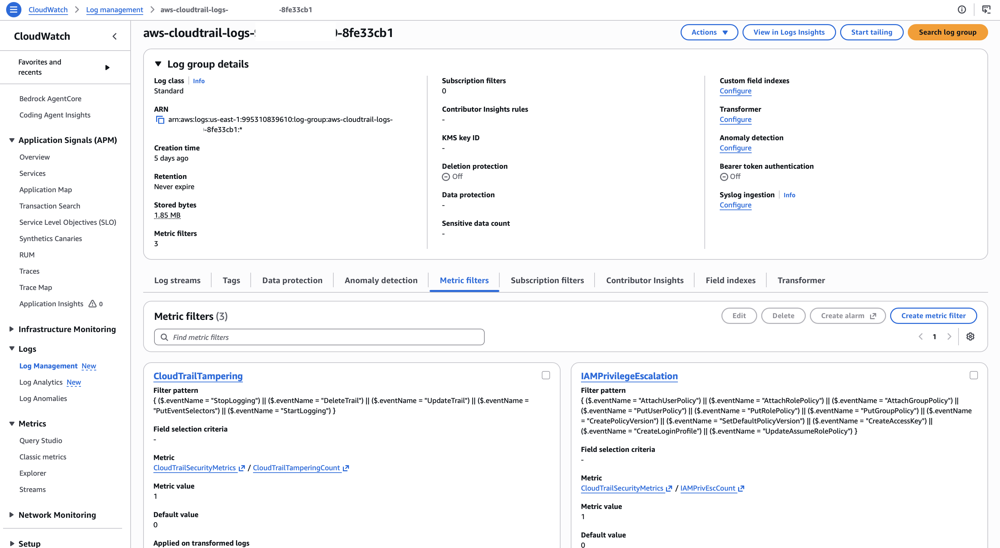

# Detection Coverage Assessment

**AWS CloudTrail Threat Detection**
Account 111122223333 · us-east-1 · Assessed 2026-09-03

An honest account of what this detection build catches, what it misses, and what an adversary could do inside it without generating an alert.

Every gap below was identified during controlled testing, not from a checklist. Where a gap was demonstrated by an actual event, the `eventID` is cited.

---

## Executive summary

Three detections were deployed and all three fired during simulated attacks. Coverage of the scenarios they were written for is complete.

Coverage of the **attack surface around those scenarios** is not. Ten gaps were identified. The most serious is architectural rather than a missing rule: **CloudWatch metric alarms notify on state transition, not per event.** During testing, 11 matching events produced 4 notifications. A CloudTrail trail was deleted while the responsible alarm sat in ALARM state and sent nothing.

| Severity | Count | Gaps |
|---|---|---|
| Critical | 1 | Notification model |
| High | 3 | Log storage tampering, no correlation, logs in audited account |
| Medium | 4 | Region handling, failed auth, data events, no network telemetry |
| Low | 2 | `CreateUser` coverage, no threat-intel enrichment |

Two gaps were caught **by** the build rather than being weaknesses in it — the multi-region trail configuration recovered evidence that would otherwise have been invisible.

---

## Critical

### C1 — Alarms notify on state change, not per event

**Demonstrated during testing.**

| Scenario | Matching events | Notifications sent |
|---|---|---|
| Root account usage | 3 | 1 |
| IAM privilege escalation | 3 | 2 |
| CloudTrail tampering | 5 | 1 |
| **Total** | **11** | **4** |

Once a CloudWatch alarm enters ALARM state, subsequent matching events produce no further notification until it returns to OK.

**What this cost, concretely.** In the tampering scenario the alarm fired at 06:09:29. Between then and its return to OK at 06:14:29, the following occurred with **no alert**:

| Time | Event | eventID |
|---|---|---|
| 06:09:20 | `StartLogging` | `34c51c39` |
| 06:10:21 | `UpdateTrail` | `44d038eb` |
| 06:10:29 | `UpdateTrail` | `622213b9` |
| 06:12:03 | **`DeleteTrail`** | `19580243` |

The trail was destroyed two and a half minutes before the alarm cleared. A responder acting on the single alert received would have arrived to find the evidence source gone.

**Why this matters more than any missing rule.** An adversary executing stop → act → delete inside two minutes generates one email regardless of how many rules match. Detection logic was correct throughout; delivery was the failure.

**Remediation:** replace CloudWatch metric alarms with EventBridge rules targeting SNS. EventBridge delivers per event rather than per state transition. This is the highest-priority fix identified.

---

## High

### H1 — Log storage tampering is out of scope

The tampering detection matches event names scoped to `cloudtrail.amazonaws.com`. Attacks against the S3 bucket holding the logs are not covered.

Demonstrated: changing the trail's log file prefix generated two `PutBucketPolicy` events against `cloudtrail-logs-example` (`5bfa1454` at 06:10:21, `240b1b5e` at 06:10:28). Neither matched any rule.

**What an adversary could do undetected:** add an external principal to the bucket policy, apply a lifecycle rule expiring logs in one day, disable versioning, or modify the bucket ACL. All are logged; none alert.

**Remediation:** extend coverage to `s3.amazonaws.com` events affecting the log bucket — `PutBucketPolicy`, `DeleteBucketPolicy`, `PutLifecycleConfiguration`, `PutBucketAcl`, `PutBucketVersioning`.

---

### H2 — Metric filters cannot correlate across events

CloudWatch metric filters evaluate one log event at a time. They count matches; they cannot express relationships between events.

**The consequence is specific.** The behaviour that actually indicates tampering is not `StopLogging` alone — that occurs during legitimate maintenance. It is `StopLogging` followed by `StartLogging` from the same identity within a short window, which creates a bounded gap in the record and then restores normal appearance.

Observed: `3c596c6d` at 06:06:01, then `34c51c39` at 06:09:20, same session, 3 minutes 19 seconds apart. Each event was matched in isolation. The pattern was invisible to the rule.

**Remediation:** SIEM ingestion with correlation rules, or EventBridge feeding a stateful processing layer.

---

### H3 — Logs reside in the account they audit

CloudTrail logs are written to an S3 bucket inside the monitored account. Any principal with administrative access to that account has access to the log store.

**Consequence:** an adversary who compromised `ak-admin` — which holds `AdministratorAccess` — could alter or delete evidence of their own activity. Log file validation makes tampering *detectable* after the fact; it does not prevent it.

**Remediation:** ship logs to a dedicated logging account with S3 Object Lock in compliance mode, so that even an account administrator cannot modify or delete stored objects.

---

## Medium

### M1 — Console sign-in events are recorded in the sign-in region

**This gap was caught by the build, not missed by it.**

The root `ConsoleLogin` (`3aa8e2da`, 05:14:46) was recorded in **us-east-2**, not the account's working region of us-east-1, because that region's `signin.amazonaws.com` endpoint served the request. Evidence appears in `additionalEventData.LoginTo`:

```
state=hashArgsFromTB_us-east-2_dbad9099c8194b21
```

This is distinct from global service events (IAM, STS, root API calls), which are consistently recorded in us-east-1.

**Consequence:** an analyst searching only the working region would conclude no root login occurred. A **single-region trail would not have captured the event at all.**


**Why it was caught:** `primary-trail` was configured multi-region with global service events enabled at creation.

**Control validated.** No remediation required. Documented because the assumption that root activity always lands in us-east-1 is common and wrong.

---

### M2 — No detection for repeated failed authentication

The root detection matches `userIdentity.type = "Root"` and fires identically on successful and failed logins. During testing, several failed attempts occurred before the successful one; they were indistinguishable in the alerting.

**Consequence:** a credential-stuffing or brute-force attempt against root produces the same single alert as one legitimate login. There is no threshold rule.

**Remediation:** a second metric filter matching `responseElements.ConsoleLogin = "Failure"` with a threshold of ≥3 within 5 minutes, at higher severity than single-login detection.

---

### M3 — S3 data events are not enabled

Only management events are logged. Object-level operations — `GetObject`, `PutObject`, `DeleteObject` — are not recorded by default.

**Consequence:** direct read, copy, or deletion of individual CloudTrail log objects would be invisible. Any post-compromise data access to other buckets would also go unrecorded. This is the gap that makes the Collection and Exfiltration tactics entirely unobservable in this build.

**Remediation:** enable data events scoped to the log bucket specifically. Not account-wide — data events bill per event and an account-wide selector on an active account becomes expensive quickly.

---

### M4 — No network-layer telemetry

No VPC Flow Logs are configured.

**Consequence:** zero visibility into exfiltration volume, destinations, or command-and-control traffic. CloudTrail records that an API call was made; it does not record what moved across the network afterward.

**Remediation:** enable VPC Flow Logs where compute resources exist. Not applicable to this lab, which had no running instances, but a required control in any environment that does.

---

## Low

### L1 — `CreateUser` is not covered by the IAM detection

The IAM privilege escalation filter matches eleven event names. `CreateUser`, `CreateRole`, and `CreateGroup` are not among them.

Demonstrated: creation of `test-analyst-user` (`80f8ece9` at 05:35:33) generated no alert. The first notification arrived 88 seconds later, at the policy attachment.

**Assessed as Low, not Medium.** Identity creation alone confers no privilege. The escalation that makes it dangerous — attaching a policy or issuing a credential — *is* covered, and detection latency between the two steps was under two minutes.

**Remediation:** add identity-creation events as a separate lower-severity rule rather than folding them into the escalation rule, so the higher-severity signal stays clean.

---

### L2 — No threat intelligence enrichment

GuardDuty is not enabled. Source IP addresses are evaluated only against a locally established baseline.

**Consequence:** an authentication from a known-malicious address, an anonymizing proxy, or a Tor exit node would appear as an unfamiliar IP and nothing more.

**Remediation:** enable GuardDuty and correlate findings against the CloudTrail timeline. Note that GuardDuty bills after its trial period and should be scoped deliberately.

---

## Attack tactics with no coverage

The simulation stopped after defense impairment. Mapping the gaps above onto tactics not exercised:

| Tactic | Visibility | Limiting gap |
|---|---|---|
| Credential Access | None | No secrets-store telemetry |
| Lateral Movement | Partial | `AssumeRole` is logged; no cross-account context |
| Collection | **None** | M3 — data events disabled |
| Exfiltration | **None** | M3, M4 — no object access or network telemetry |
| Impact | Partial | Resource deletion is logged as management events |

An intrusion following the observed path would continue into Collection and Exfiltration, and **this build would not see either.**

---

## What the build does cover

Stated for balance, since a gap analysis reads worse than the system deserves:

| Capability | Status | Evidence |
|---|---|---|
| Root account usage detection | Working | `3aa8e2da`, alert in ~1 min 24 sec |
| IAM privilege escalation detection | Working | `f235ea6b`, alert in ~1 min |
| CloudTrail tampering detection | Working | `3c596c6d`, alert in ~3 min 28 sec |
| Multi-region collection | Working | Recovered a login recorded outside the working region |
| Log integrity verification | Working | Digest files enabled at trail creation; validation possible |
| Durable retention | Working | S3 delivery confirmed, no expiry configured |
| Session-level attribution | Working | `sessionContext.creationDate` correlated 679 of 680 events |


| Severity discrimination by target | **Partial** | Requires reading `requestParameters` manually; not encoded in the rule |

---

## Remediation priority

| # | Gap | Severity | Effort | Fixes |
|---|---|---|---|---|
| 1 | C1 — notification model | Critical | Medium | Move to EventBridge per-event delivery |
| 2 | H1 — log storage tampering | High | Low | Add S3 log-bucket events to detection |
| 3 | H3 — logs in audited account | High | High | Separate logging account + Object Lock |
| 4 | H2 — no correlation | High | High | SIEM ingestion |
| 5 | M3 — data events | Medium | Low | Enable scoped to log bucket |
| 6 | M2 — failed auth threshold | Medium | Low | Second metric filter |
| 7 | L1 — `CreateUser` | Low | Low | Add to a separate rule |
| 8 | L2 — threat intel | Low | Low | Enable GuardDuty |

Items 2, 5, 6, 7, and 8 are each under an hour. Items 1, 3, and 4 are architectural and would be addressed in a production design rather than retrofitted here.

---

## Method

Gaps were identified in three ways, in order of confidence:

1. **Demonstrated during testing** — an event occurred and no alert fired, or fewer alerts fired than events matched. C1, H1, H2, L1, M1.
2. **Derived from configuration** — a control is absent by inspection. H3, M2, M3, M4, L2.
3. **Derived from tactic mapping** — a stage of the attack chain has no corresponding telemetry source. The tactics table above.

No gap in this document is speculative. Each is either backed by an `eventID` or by a verifiable absence in the account configuration.
