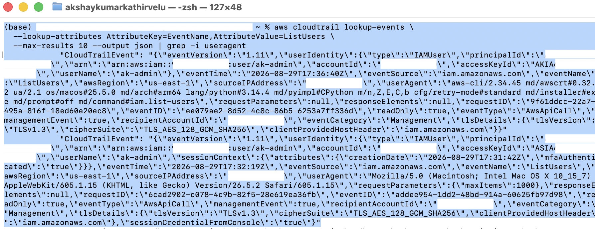

# Lessons Learned

AWS CloudTrail Threat Detection — technical and operational findings.

---

## CloudTrail behaviour

### Region handling is not intuitive

Console sign-in events are written to whichever region's endpoint handled the authentication request, which is not necessarily where the account operates. Root `ConsoleLogin` for this project was recorded in **us-east-2** while all other activity occurred in **us-east-1**.

This is separate from *global service events* (IAM, STS, root API activity), which are consistently recorded in us-east-1.

Practical consequence: root login investigation requires searching across regions, or querying the aggregated S3 log bucket, rather than relying on the region-scoped Event history view.

### Root identity fields differ between console sign-in and API calls

Root activity does not present consistently. Two distinct shapes were observed in the same session.

**Root `ConsoleLogin`** — no `userName` field at all:

```json
"userIdentity": {
    "type": "Root",
    "principalId": "<account-id>",
    "arn": "arn:aws:iam::<account-id>:root",
    "accountId": "<account-id>",
    "accessKeyId": ""
}
```
Verified against eventID `3aa8e2da-efb8-4e35-8e7a-eedccf58ecdb`.


**Root API calls** — `userName` is present and contains the **account alias**, not an IAM user:

```json
"userIdentity": {
    "type": "Root",
    "arn": "arn:aws:iam::<account-id>:root",
    "accessKeyId": "ASIA...",
    "userName": "<account-alias>"
}
```
Verified against eventID `8eabd0f7-824d-4b65-958b-236d828c698b` (`GetAccessKeyLastUsed`). All 127 root API events in the captured session carried this field with the same value.

**Why this matters for investigation.** Filtering Event history by username will not surface the root sign-in, because that event has no username to match. It may or may not surface subsequent root API activity, depending on whether the analyst happens to search for the account alias — which looks like an IAM username and is easy to mistake for one.

This was the exact failure encountered during the investigation: a username pivot returned 680 IAM events and missed the root login entirely.

`userIdentity.type` is the only reliable field, which is why the detection was built on it.

Two further properties of the sign-in event:

- `accessKeyId` is empty, so the session-correlation pivot that worked across all IAM activity does not apply to root console logins.
- `eventType` is `AwsConsoleSignIn`, not `AwsApiCall`. Detections filtering on `eventType = "AwsApiCall"` will silently exclude console sign-ins.

### Log file validation cannot be applied retroactively

Digest files are only produced for logs delivered after the setting is enabled. Logs written before that point can never be validated. This must be set at trail creation.

### Management events and data events are separate

Only management events are captured by default. `GetObject`, `PutObject`, and `DeleteObject` are data events and are not logged unless explicitly enabled — and they bill per event, so they should be scoped to specific buckets rather than enabled account-wide.

---

## Reading events

### Volume is meaningless in cloud logs

A single EC2 console page load produced roughly 15 API calls across six services that were never opened. A two-minute root browsing session produced **127 events**, all read-only.

Any detection based on "unusual volume of activity" fails immediately. Detection must key on specific event names and on whether state was changed.

### `readOnly` is the primary noise filter

All 127 events from the root session were `readOnly: true`. Filtering to `readOnly: false` reduced the entire simulated attack to roughly ten lines.

### AWS itself appears in the logs

Events with `userAgent: "AWS Internal"` and `eventType: "AwsServiceEvent"` are generated by Amazon, not by any principal in the account. Without explicit exclusions, these become the first false positives.

This is why the root detection includes:

```
$.userIdentity.invokedBy NOT EXISTS
$.eventType != "AwsServiceEvent"
```

### Access key prefix determines the containment path

| Prefix | Type | Expires | MFA |
|---|---|---|---|
| `AKIA` | Long-term IAM user key | Never | Not applied |
| `ASIA` | Temporary STS session credential | Yes | Can be enforced |

Deactivating the key an `ASIA` credential derives from does **not** invalidate sessions already issued. Role compromise requires session revocation, not just key deactivation.

Consequence: MFA protects the console path and does nothing for a leaked long-term access key. Key hygiene sits alongside MFA, not behind it.



### The same API call looks different depending on origin

`ListUsers` called from the CLI and from the console differed in five fields — `userAgent`, `accessKeyId` prefix, presence of `sessionCredentialFromConsole`, presence of MFA context, and `requestParameters`.

`userAgent` is set by the caller and can be spoofed. `sessionCredentialFromConsole` is set by AWS and is the more reliable indicator of console origin.

---

## Detection design

### Severity lives in `requestParameters`, not `eventName`

Two `AttachUserPolicy` events, 76 seconds apart, same identity, same source IP, same session:

```
ReadOnlyAccess   → routine administration
IAMFullAccess    → privilege escalation
```

Identical in every field except `policyArn`. A rule keyed on event name alone cannot distinguish them. Severity must be conditional on the target of the action.


### Detections have different shapes

| Type | Matches on | Example | FP rate |
|---|---|---|---|
| Identity | `userIdentity.type` | Root usage | Low |
| Action | List of `eventName` values | IAM escalation | High |
| Behavioural | Sequence of events | Stop → Start logging | Near zero |

Knowing which shape a behaviour requires is most of the design work.

### A rule is defined by what it excludes

The exclusions in the root rule (`invokedBy`, `eventType`) do as much work as the match condition. They were written because AWS-internal activity was observed in the baseline before any detection existed — which is the argument for building a baseline first.

### Broad detections are noisy; narrow ones are blind

The IAM rule fires on legitimate administrative work — confirmed during testing when attaching `ReadOnlyAccess` triggered an alert. Tuning it to admin-level policy ARNs only would reduce noise but miss an attacker granting a narrow but dangerous permission.

There is no configuration that avoids this trade-off. It is chosen, not solved.

---

## Alerting architecture

### Notification model, not detection logic, was the limiting factor

Across three test scenarios, 11 matching events produced 4 notifications. CloudWatch alarms notify on **state transition**, not per event. A burst of related activity collapses into a single alert, and the alarm remains silent for the remainder of the burst.

In the tampering test, one alert was delivered. The trail was then modified twice and deleted with no further notification.

The detections were correct. The delivery mechanism was the weakness. Per-event notification requires EventBridge or SIEM ingestion.

### Alert arrival time is not event time

Time to alert ranged from ~1 minute to ~3.5 minutes, driven mainly by CloudWatch Logs ingestion lag.

In the tampering test the `StopLogging` alert (event at 06:06:01) arrived at 06:09:29 — seconds after `StartLogging` was clicked. This created a misleading impression that the alert corresponded to the restart.

Timelines must be reconstructed from `eventTime` in CloudTrail, never from notification arrival time.

### `TreatMissingData` matters for rare events

Security events are rare, so most evaluation periods contain no data. Without `notBreaching`, alarms sit permanently in `INSUFFICIENT_DATA` and appear broken.

---

## Testing and validation

### Destructive scenarios need a disposable target

A second throwaway trail (`secondary-trail`) made it possible to simulate log tampering — stop, modify, delete — while `primary-trail` recorded every step, including the `DeleteTrail` call itself.

Without this, testing the tampering detection would have required disabling the only source of visibility.

### `DeleteTrail` requires no confirmation

Deleting an audit trail was a single click with no confirmation prompt. Preventive controls (SCPs denying `cloudtrail:DeleteTrail` outside a break-glass role) matter more than detection here, because by the time the alert arrives the evidence source is gone.

### An untested detection is not a detection

Every rule in this project was verified in both directions: it fired on the simulated attack, and its behaviour on benign activity was recorded rather than assumed. The false positive on `ReadOnlyAccess` was generated deliberately as a control case.

---

## Investigation practice

### Negative findings are findings

"No use of the created access key was observed in the following period" is a result. Recording only what was found leaves a reader unable to judge scope.

### Pivot on the credential, not the username

Every action within a session shares the same `accessKeyId`. Unlike source IP, it survives an attacker changing networks, and it groups activity into sessions cleanly.

### Responder activity appears in the same logs

`LookupEvents` calls made during investigation are themselves recorded. In a real incident, responder actions must be separated from attacker actions when building a timeline.

### The pivot determines the blind spot

The first timeline was built by pivoting on `User name = ak-admin`. It returned 680 events and every state change in the incident window — and **zero root events**. Root activity carries no IAM username, so a username pivot silently excludes it. The root `ConsoleLogin`, arguably the first stage of the chain, was only recovered by rerunning the search on event name.

Whatever field a search is keyed on defines what that search cannot find. Recovery pivots here were `sourceIPAddress`, shared across both phases, or an unfiltered time window.

### ATT&CK identifiers and tactic names change between versions

Two mapping errors were found by checking attack.mitre.org rather than working from memory:

1. **T1562.008 has been renumbered to T1685.002** — "Disable or Modify Tools: Disable or Modify Cloud Log," parent T1685. The old URL redirects, which is how the change surfaced. The tactic formerly called **Defense Evasion** no longer exists under that name; it is now split into **Stealth** and **Defense Impairment**.

2. **`DeleteTrail` was initially mapped to T1070 (Indicator Removal). That mapping was invalid.** T1070's listed platforms are Containers, ESXi, Linux, Network Devices, Office Suite, Windows, and macOS — IaaS is absent. A technique that does not list the relevant platform is the wrong technique, however well its description appears to fit. Platform applicability is a verification step, not optional detail.

Practical consequence: record the ATT&CK version and verification date alongside any mapping. A citation copied from an older writeup, or recalled from memory, will eventually be wrong.

### Verify the source rather than the summary

Both ATT&CK errors above originated from a confident secondary source and survived until the primary source was opened. The cost of checking was seven browser tabs. The cost of not checking would have been two wrong citations in a published repository.

---

## Process

### Setup decisions constrain everything downstream

Four settings had to be correct at trail creation and could not be fixed later: log file validation, CloudWatch Logs integration, multi-region scope, and the existence of a second disposable trail. Discovering the need for these mid-project would have meant rebuilding.

### Baseline before detection

Building a baseline of normal activity before writing any rules produced the exclusions that prevented the first false positives. Writing rules first would have meant discovering AWS-internal events by being paged by them.

### Root was hardened before the admin user was

MFA was enabled on the root account at the start of the project. `ak-admin` — which holds `AdministratorAccess` and can perform nearly everything root can — was initially created without it.

An attacker holding those credentials would have no reason to target root. Hardening the most visible identity while leaving an equally powerful one exposed is a realistic and common gap.
