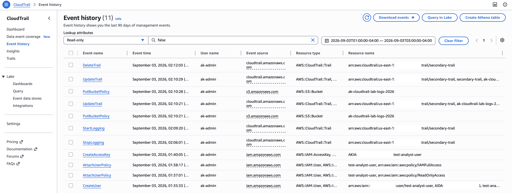
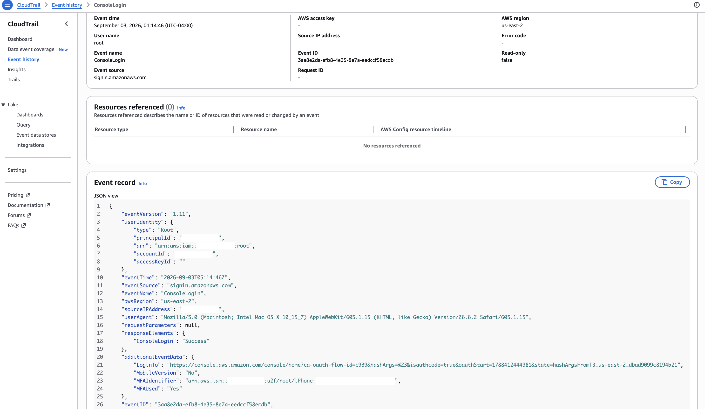
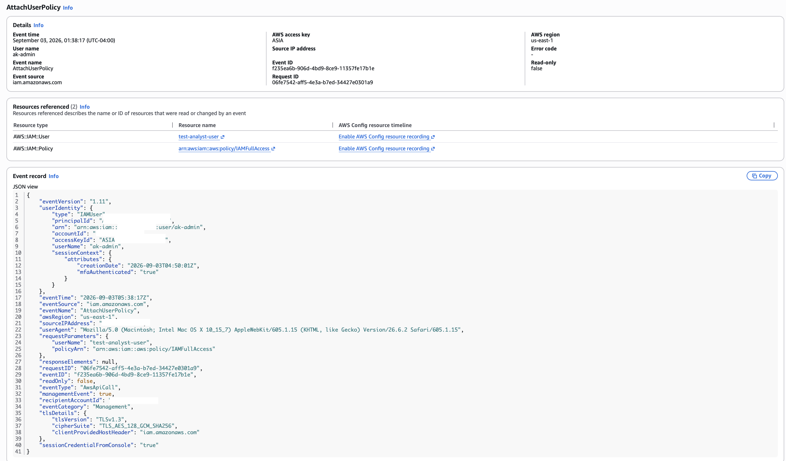
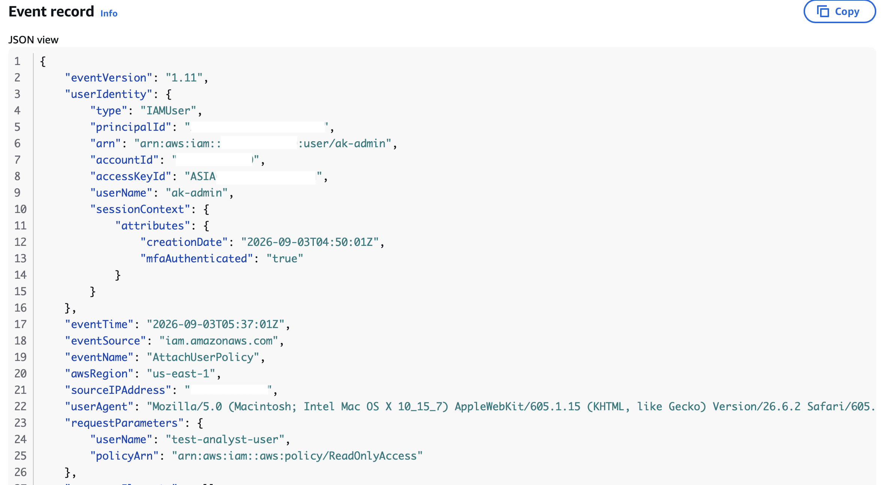
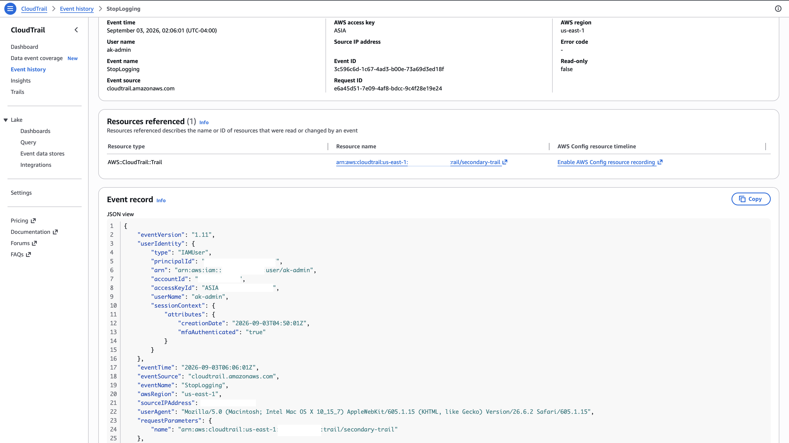
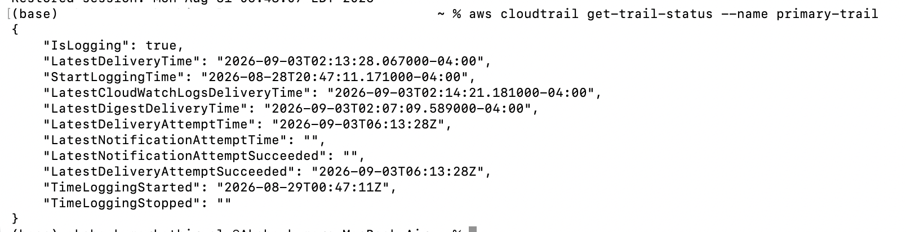

# CloudTrail Investigation Report

**Incident:** Suspicious AWS account activity
**Analyst:** Akshaykumar Kathirvelu
**Account:** 111122223333
**Region:** us-east-1
**Investigation date:** 2026-09-03
**Data source:** AWS CloudTrail (`primary-trail`), management events
**Timezone:** All times UTC unless marked local. Local = UTC−4.

> **Note on scope:** This is simulated adversary emulation. All activity was generated by the account owner in a controlled lab. The investigation below was conducted from log evidence only; ground truth was not consulted until Section 7.

---

## 1. Alert

| Field | Value |
|---|---|
| Triggering alarm | `ALARM-IAMPrivilegeEscalation` |
| Alert received (UTC) | 05:38:06 |
| Alarm description | IAM permission or credential change detected. MITRE ATT&CK T1098.001, T1098.003. Check the target identity and policyArn in requestParameters. |
| Initial severity | High |

**Investigation question:**
> Did an unauthorized identity gain elevated AWS privileges or attempt to disable logging?

---

## 2. Actor identification

| Field | Value |
|---|---|
| Identity ARN | `arn:aws:iam::111122223333:user/ak-admin` |
| `userIdentity.type` | IAMUser |
| Account ID | 111122223333 |
| Source IP address | 203.0.113.10 |
| `userAgent` | Mozilla/5.0 (Macintosh; Intel Mac OS X 10_15_7) Safari/605.1.15 |
| Origin (console / CLI / SDK) | Console — confirmed by `sessionCredentialFromConsole: "true"` |

### Session analysis

Pivot on `userIdentity.accessKeyId`. Every action within one login session shares the same key.

| Access key ID | Prefix | Session start (`creationDate`) | MFA | Events in session |
|---|---|---|---|---|
| `ASIAEXAMPLEKEYID0001` and related ASIA keys | ASIA | 2026-09-03T04:50:01Z | true | 679 |
| One CLI-originated key | AKIA | *(no sessionContext)* | n/a | 1 |
| `AKIAEXAMPLEKEYID0001` *(created, never used)* | AKIA | — | — | 0 |

**How many distinct sessions are present?**

One. `sessionContext.creationDate` is `2026-09-03T04:50:01Z` on 679 of 680 events. The IAM escalation at 05:38 and the CloudTrail destruction at 06:12 — 34 minutes apart, different services — originated from a single console login. Session correlation ties both phases to one actor without relying on IP or username.

**What does the AKIA vs ASIA prefix tell you about each?**

`ASIA` indicates temporary STS credentials issued by the console; they expire on their own and carried MFA context. `AKIA` indicates a long-term IAM user key with no expiry and no MFA. The prefix split cleanly separates browser activity from command-line activity across the whole dataset, and it determines the containment path: deactivating a key stops `AKIA` access immediately, but does not invalidate `ASIA` sessions already issued.

---

## 3. Timeline

Only `readOnly: false` events. Sorted by `eventTime`. 680 events in the window; 11 were state-changing.

| # | Time (UTC) | Event name | Target resource | Event ID | Assessment |
|---|---|---|---|---|---|
| 1 | 05:35:33 | `CreateUser` | test-analyst-user | `80f8ece9` | Target identity created |
| 2 | 05:37:01 | `AttachUserPolicy` | test-analyst-user / ReadOnlyAccess | `aa8026e4` | Low privilege — control case |
| 3 | 05:38:17 | `AttachUserPolicy` | test-analyst-user / IAMFullAccess | `f235ea6b` | **Privilege escalation** |
| 4 | 05:40:05 | `CreateAccessKey` | test-analyst-user | `7077c297` | **Persistence** |
| 5 | 06:06:01 | `StopLogging` | secondary-trail | `3c596c6d` | **Defense evasion** |
| 6 | 06:09:20 | `StartLogging` | secondary-trail | `34c51c39` | Gap concealed |
| 7 | 06:10:21 | `UpdateTrail` | secondary-trail | `44d038eb` | Log destination altered |
| 8 | 06:10:21 | `PutBucketPolicy` | cloudtrail-logs-example | `5bfa1454` | Log storage policy modified |
| 9 | 06:10:28 | `PutBucketPolicy` | cloudtrail-logs-example | `240b1b5e` | Log storage policy modified |
| 10 | 06:10:29 | `UpdateTrail` | secondary-trail | `622213b9` | Log destination altered |
| 11 | 06:12:03 | `DeleteTrail` | secondary-trail | `19580243` | **Audit record destroyed** |

Recovered separately (see 4.1): root `ConsoleLogin` at 05:14:46, eventID `3aa8e2da`, recorded in us-east-2.

**First event:** 05:14:46 (root login) — or 05:35:33 if counting write events only
**Last event:** 06:12:03 (`DeleteTrail`)
**Total duration:** 57 minutes 17 seconds, including a 26-minute gap with no state changes between 05:40:05 and 06:06:01

---

## 4. Key evidence



### 4.1 Root account activity

| Field | Value |
|---|---|
| `ConsoleLogin` event ID | `3aa8e2da-efb8-4e35-8e7a-eedccf58ecdb` |
| Time (UTC) | 2026-09-03T05:14:46Z |
| `additionalEventData.MFAUsed` | Yes |
| `responseElements.ConsoleLogin` | Success |
| Source IP | 203.0.113.10 |
| Region recorded | **us-east-2** (not the working region) |
| Actions taken during root session | Viewed Billing and Cost Management; viewed IAM. All read-only. |

**Was this expected?**

Not determinable from the log. The login succeeded with MFA from the account's habitual source IP. There is no technical anomaly. In a production environment this would require out-of-band confirmation — a change ticket or direct contact with the account owner.

**Investigative finding — the pivot determined the blind spot.**

The initial timeline was built by pivoting on `User name = ak-admin`. That returned all 680 events and every state change above — and **zero root events**. Root activity carries no IAM username, so a username pivot silently excludes it. The root login was recovered only by rerunning the search on `Event name = ConsoleLogin` across a wider window.



**Secondary finding — region.** The `ConsoleLogin` was written to us-east-2 because that region's `signin.amazonaws.com` endpoint served the request. This is distinct from global service events (IAM, STS, root API calls), which consistently land in us-east-1. A single-region trail would not have captured it at all. The multi-region configuration on `primary-trail` is the only reason this evidence exists.

---

### 4.2 Privilege escalation

Two `AttachUserPolicy` events occurred against the same target.

| | Event A | Event B |
|---|---|---|
| Time (UTC) | 05:37:01 | 05:38:17 |
| `eventName` | `AttachUserPolicy` | `AttachUserPolicy` |
| Target `userName` | test-analyst-user | test-analyst-user |
| `policyArn` | `arn:aws:iam::aws:policy/ReadOnlyAccess` | `arn:aws:iam::aws:policy/IAMFullAccess` |
| Source IP | 203.0.113.10 | 203.0.113.10 |
| `accessKeyId` | ASIA (same session) | `ASIAEXAMPLEKEYID0001` |
| Event ID | `aa8026e4` | `f235ea6b` |
| Severity | Informational | **Critical** |

Escalation — `IAMFullAccess`:



**What is the only field that differs?**

`requestParameters.policyArn`. Event name, identity, source IP, user agent, session context, MFA status, and region are identical. The two events are 76 seconds apart.

Benign case — `ReadOnlyAccess`:



**Why does this matter for detection design?**

A rule keyed on `eventName` alone cannot separate routine administration from privilege escalation — it will fire on both. Severity must be conditional on the target of the action, read from `requestParameters`. This is the difference between an alert that means something and an alert that gets ignored.

---

### 4.3 Persistence

| Field | Value |
|---|---|
| `CreateAccessKey` event ID | `7077c297` |
| Time (UTC) | 05:40:05 |
| Target user | test-analyst-user |
| New key prefix | `AKIAEXAMPLEKEYID0001` |
| Key expires? | No — long-term IAM user key |
| Subject to MFA? | No |

A long-term programmatic credential survives console session expiry and bypasses MFA entirely. This is the artifact that converts a temporary console foothold into durable access.

---

### 4.4 Defense evasion

| # | Time (UTC) | Event | Target |
|---|---|---|---|
| 1 | 06:06:01 | `StopLogging` | secondary-trail |
| 2 | 06:09:20 | `StartLogging` | secondary-trail |
| 3 | 06:10:21 | `UpdateTrail` | secondary-trail |
| 4 | 06:10:29 | `UpdateTrail` | secondary-trail |
| 5 | 06:12:03 | `DeleteTrail` | secondary-trail |

Two additional `PutBucketPolicy` events (06:10:21, 06:10:28) were generated against the log bucket as a side effect of the prefix change. These were **not** matched by the tampering detection, which is scoped to `cloudtrail.amazonaws.com` event names only.



**Did the attacker restore logging after stopping it? What would that accomplish?**

Yes — `StartLogging` at 06:09:20, three minutes nineteen seconds after `StopLogging`. Restarting creates a bounded gap in the record while leaving the trail in a normal-looking state. An analyst checking current configuration would see logging enabled and find nothing wrong. The gap is only visible by examining event history, not current state.

Neither event is suspicious alone. The sequence is the detection.

**Which trail was targeted? Did any trail survive? How do you know?**

`secondary-trail` only. `primary-trail` survived, confirmed by `get-trail-status`:

```
"IsLogging": true,
"LatestCloudWatchLogsDeliveryTime": "2026-09-03T02:14:21-04:00",
"TimeLoggingStopped": ""
```



`TimeLoggingStopped` is empty, meaning `primary-trail` was never stopped. It recorded every step of `secondary-trail`'s destruction, including the `DeleteTrail` call itself.

---

## 5. Post-compromise checks

Negative findings are findings. Record what you looked for and did not find.

| Check | Method | Result |
|---|---|---|
| Was the new access key ever used? | Search events where `accessKeyId` = `AKIAEXAMPLEKEYID0001` | **No.** Zero events. Persistence credential never exercised. |
| Any activity after `DeleteTrail`? | Filter events after 06:12:03 | Read-only console activity only. No further state changes. |
| Any `AccessDenied` / `UnauthorizedOperation` errors? | Check `errorCode` field | **None.** Every write action succeeded on first attempt. |
| Any additional users created? | Search `CreateUser` | One only — `test-analyst-user` at 05:35:33. |
| Any console password set on the target user? | Search `CreateLoginProfile` | **None.** Target had no console access at any point. |
| Any activity from a different source IP? | Compare `sourceIPAddress` across all events | **No.** All 680 events from 203.0.113.10, including the root login. |
| Any escalation to AdministratorAccess? | Search `AttachUserPolicy` for admin ARN | **No.** Escalation stopped at `IAMFullAccess`. |
| Any cross-account or role activity? | Search `AssumeRole` | **None** from the affected identity. |

---

## 6. Attack path

```
Initial Access        Root ConsoleLogin, MFA, 05:14:46
      ↓
Discovery             Root viewed IAM and Billing (read-only)
      ↓
Persistence           CreateUser — test-analyst-user, 05:35:33
      ↓
Privilege Escalation  AttachUserPolicy — IAMFullAccess, 05:38:17
      ↓
Persistence           CreateAccessKey — AKIA, 05:40:05
      ↓
Defense Impairment    StopLogging → StartLogging → UpdateTrail ×2 → DeleteTrail
```

**Narrative:**

At 05:14:46 the root account authenticated to the console with MFA from 203.0.113.10, and browsed IAM and Billing without making changes. Twenty minutes later, an IAM user session that began at 04:50:01Z created a new identity, `test-analyst-user`, attached `ReadOnlyAccess`, then 76 seconds later attached `IAMFullAccess`, and issued the account a long-term access key. After a 26-minute pause with no state changes, the same session stopped logging on `secondary-trail`, restarted it three minutes later, modified its configuration twice, and deleted it. `primary-trail` was untouched and captured the entire sequence.

---

## 7. Ground truth comparison

| Question | Answer |
|---|---|
| Did the logs capture every action performed? | Yes for all state-changing actions. 9 of 9 write actions present with accurate timestamps. |
| Any actions performed that produced **no** log entry? | None identified. Console sign-out was not separately verified. |
| Any events in the logs that were **not** performed by the analyst? | Yes — two `PutBucketPolicy` events generated by the console as a side effect of the prefix change. S3 was never opened directly. Also ~669 read-only events from console page rendering and AWS-internal service calls. |
| Was the reconstructed sequence correct? | Yes. Order and timestamps matched ground truth exactly. |
| What was missed, and why? | The root login, on the first pass. The username pivot excluded it because root activity carries no IAM username. Recovered on a second search by event name. |

**Reconstruction accuracy:** 9 of 9 state-changing ground-truth actions recovered from logs on the first pass; 1 of 1 root authentication recovered after changing pivot.

**Could intent have been reconstructed without ground truth?**

Partially. The sequence itself is unambiguous — create an identity, grant it IAM control, mint a non-expiring key, disable audit logging, delete the trail. That ordering does not occur during routine maintenance, and any analyst would escalate on it.

But every event is MFA-authenticated, from the account's habitual source IP, within a single legitimate session. **There is no technical indicator of compromise anywhere in the data.** Had `ak-admin` been an adversary holding valid stolen credentials, the log record would be byte-identical.

CloudTrail establishes *what* happened and *which identity* did it with certainty. It cannot establish whether that identity was authorized. That determination requires out-of-band confirmation.

---

## 8. MITRE ATT&CK mapping

All technique IDs verified against attack.mitre.org on 2026-09-03. Evidence cited by `eventID`. Full detail and verification notes in `mitre-attack-mapping.md`.

| Observed behavior | Tactic | Technique ID | Technique name | Evidence (eventID) |
|---|---|---|---|---|
| Root account console login | Initial Access / Stealth / Persistence / Privilege Escalation | T1078.004 | Valid Accounts: Cloud Accounts | `3aa8e2da` |
| Root viewed IAM and Billing | Discovery | T1087.004 | Account Discovery: Cloud Account | *(read-only events, low confidence)* |
| IAM user created | Persistence | T1136.003 | Create Account: Cloud Account | `80f8ece9` |
| Admin-level policy attached | Persistence / Privilege Escalation | T1098.003 | Account Manipulation: Additional Cloud Roles | `f235ea6b` |
| Access key created | Persistence / Privilege Escalation | T1098.001 | Account Manipulation: Additional Cloud Credentials | `7077c297` |
| CloudTrail stopped, restarted, modified | Defense Impairment | T1685.002 | Disable or Modify Tools: Disable or Modify Cloud Log | `3c596c6d`, `34c51c39`, `44d038eb`, `622213b9` |
| Log bucket policy modified | Defense Impairment | T1685.002 | Disable or Modify Tools: Disable or Modify Cloud Log | `5bfa1454`, `240b1b5e` |
| CloudTrail trail deleted | Defense Impairment | T1685.002 | Disable or Modify Tools: Disable or Modify Cloud Log | `19580243` |

**Two corrections resulted from verification:**

1. **T1562.008 has been renumbered to T1685.002** (Disable or Modify Tools: Disable or Modify Cloud Log, parent T1685). The old identifier redirects. Mapping from memory or from older writeups produces wrong citations.

2. **`DeleteTrail` was initially mapped to T1070 (Indicator Removal). That mapping was invalid.** T1070's listed platforms are Containers, ESXi, Linux, Network Devices, Office Suite, Windows, and macOS — IaaS is absent. A technique that does not list the relevant platform is the wrong technique, however well its description appears to fit. Reassigned to T1685.002.

**Tactic naming:** the tactic formerly called Defense Evasion no longer appears under that name in the verified version. It is now represented by **Stealth** and **Defense Impairment**.

**T1098.003 spans two tactics.** Attaching `IAMFullAccess` elevates privilege and establishes persistence in a single action.

**Behaviors observed that could not be cleanly mapped:**

- `StartLogging` (`34c51c39`) — benign in isolation and routine during maintenance. Its significance is positional, following `StopLogging` from the same session. Mapped to T1685.002 as part of a sequence rather than as a standalone instance.
- `PutBucketPolicy` — targets the S3 storage layer rather than CloudTrail. Mapped by effect, but sits outside the detection rule's scope.
- Failed root login attempts before 05:14:46 — operator error during testing, not adversarial. Mapping them to T1110 would be dishonest.
- `LookupEvents` calls made during this investigation — responder activity, excluded from the adversary timeline.

**Tactics not observed:** Credential Access, Lateral Movement, Collection, Exfiltration, Impact. The simulation stopped after defense impairment. A real intrusion following this path would continue into Collection and Exfiltration, and this build has no visibility into either.

---

## 9. Assessment

| Field | Value |
|---|---|
| Verdict | **Simulated adversary emulation** — confirmed benign on comparison with ground truth. Would be *confirmed malicious* if unattributed. |
| Confidence | High (attribution and sequence). Medium (intent, absent out-of-band confirmation). |
| Basis for verdict | Single-session correlation via `sessionContext.creationDate`; complete write-event timeline; ground-truth comparison confirming 9 of 9 actions. |
| Limiting factors | No technical indicator distinguishes authorized from compromised use of valid credentials. No S3 data events, no VPC Flow Logs, no AWS Config, no GuardDuty enrichment. |

**Escalation trigger:** at what point would you stop investigating and hand off?

At `StopLogging` (06:06:01). Confirmed unauthorized privilege change on a live identity is already grounds for escalation; deliberate impairment of audit logging removes any argument for continuing analysis before containment. In a production environment the trail deletion alone would justify treating the account as compromised and escalating immediately, with root-cause analysis deferred until after containment.

---

## 10. Impact

**If this activity had been unauthorized, what could the actor have done?**

`IAMFullAccess` permits modification of any IAM entity in the account, including self-elevation to `AdministratorAccess`, creation of additional identities, and modification of role trust policies to enable cross-account access. The `AKIA` access key provides non-expiring programmatic access not subject to MFA, surviving password rotation and console session revocation. Deletion of a trail removes both future collection and the configuration record of what was being collected.

Combined, this is full account compromise with durable access and degraded forensic visibility.

**What was actually affected in this environment?**

`test-analyst-user` was created with no console password and no pre-existing credential, so the granted permissions were never usable by any party. The created access key was never exercised — confirmed by negative search. `secondary-trail` was deliberately disposable. `primary-trail` was never touched and logged continuously throughout.

Actual impact: none.

---

## 11. Visibility gaps

What could have happened that this logging would **not** have caught. Severity as assessed in the full coverage assessment.

| Severity | Gap | Consequence |
|---|---|---|
| **Critical** | Alarms notify on state change, not per event | 11 matching events produced 4 notifications. The trail was deleted at 06:12:03 with no alert, because the alarm had been red since 06:09:29. |
| High | Log storage tampering not covered | Two `PutBucketPolicy` events against the log bucket (`5bfa1454`, `240b1b5e`) matched no rule. The bucket could be opened to an external principal or given a 1-day lifecycle expiry silently. |
| High | Metric filters cannot correlate | `StopLogging` followed by `StartLogging` cannot be expressed as one rule. Filters count; they do not sequence. |
| High | Logs stored in the audited account | Any account administrator can reach the log bucket. Real isolation requires a separate logging account with S3 Object Lock. |
| Medium | Console logins recorded in the sign-in region | Root `ConsoleLogin` landed in us-east-2, not the working region. Caught only because the trail was multi-region. |
| Medium | No failed-authentication threshold | Root rule fires identically on success and failure. Brute force produces the same single alert as one login. |
| Medium | S3 data events disabled | `GetObject` / `DeleteObject` on CloudTrail log files invisible. Stored logs could be read or deleted directly. |
| Medium | No VPC Flow Logs | Zero network-layer visibility — exfiltration volume, destinations, C2. |
| Low | `CreateUser` not in the IAM filter | Identity creation generated no alert. First notification came 88 seconds later at policy attachment. |
| Low | No GuardDuty | No threat-intel enrichment. A known-bad or anonymizing-proxy source IP would not be flagged. |

**Tactics with no coverage at all:** Collection and Exfiltration. Both depend on S3 data events and network telemetry, neither of which is enabled. An intrusion continuing past the observed defense-impairment stage would not be visible.

Full analysis, remediation priority, and method in `detection-coverage-assessment.md`.

---

## 12. Recommended response

### Containment

1. Deactivate access key `AKIAEXAMPLEKEYID0001` on `test-analyst-user` — `aws iam update-access-key --status Inactive`
2. Delete any login profile on the affected identity
3. Attach an explicit deny-all inline policy as an immediate kill switch
4. For role-based compromise, apply `AWSRevokeOlderSessions` — deactivating a key does not invalidate `ASIA` sessions already issued from it

### Eradication

5. Detach `IAMFullAccess` and `ReadOnlyAccess` from `test-analyst-user`
6. Delete `test-analyst-user`
7. Recreate the deleted trail with log file validation enabled

### Recovery

8. Verify `primary-trail` status — `aws cloudtrail get-trail-status`
9. Run `aws cloudtrail validate-logs` against digest files to confirm no stored logs were altered
10. Review all remaining activity from session `2026-09-03T04:50:01Z`
11. Confirm the log bucket policy was restored to its prior state

### Preventive controls

12. Enable MFA on `ak-admin` — root was hardened at project start, but the IAM admin user holding `AdministratorAccess` was not
13. SCP denying `cloudtrail:StopLogging` and `cloudtrail:DeleteTrail` outside a break-glass role — `DeleteTrail` executed with no confirmation prompt, so prevention matters more than detection here
14. Permission boundaries limiting `iam:*` outside a designated administrative role
15. Ship logs to a dedicated logging account with S3 Object Lock
16. Migrate notification from CloudWatch alarms to EventBridge rules for per-event delivery
17. Add `CreateUser`, `CreateRole`, `CreateGroup`, and S3 log-bucket events to detection coverage

---

## 13. Evidence index

### Log exports

| File | Records | Description |
|---|---|---|
| `evidence/incident-events-raw.json` | 11 | All state-changing events in the incident window, 05:35:33–06:12:03 |
| `evidence/root-session-events.json` | 127 | Full root console session, 05:14:50–05:16:48. All read-only — demonstrates console event volume |
| `evidence/baseline-events.json` | 40 | Normal-activity baseline captured before any detections were written |
| `evidence/trail-status-primary.txt` | — | `get-trail-status` for `primary-trail` |
| `evidence/trail-status-secondary.txt` | — | `get-trail-status` for `secondary-trail`, before deletion |

All exports require redaction of account ID and source IP before publication.

### Screenshots

| File | Shows |
|---|---|
| `16-attach-policy-iamfullaccess.png` | `AttachUserPolicy` — `IAMFullAccess` (`f235ea6b`) |
| `17-attach-policy-benign.png` | `AttachUserPolicy` — `ReadOnlyAccess` (`aa8026e4`), control case |
| `20-stoplogging-event.png` | `StopLogging` (`3c596c6d`) — accessKeyId and sessionContext |
| `21-primary-trail-survived.png` | `get-trail-status` confirming `primary-trail` never stopped |
| `22-timeline-output.png` | Event history filtered `readOnly=false` — 11 write events |
| `23-root-login-event.png` | Root `ConsoleLogin` (`3aa8e2da`) — us-east-2, `MFAUsed: Yes` |
| `24-mitre-technique-verified.png` | T1685.002 verified on attack.mitre.org |
| `12`–`19` | Alarm states and SNS notifications for all three scenarios |
| `01`–`11` | Trail configuration, CloudWatch integration, and detection setup |

Screenshots 16 and 17 are the key pair: identical events 76 seconds apart, differing only in `policyArn`.

### Supporting documents

| File | Description |
|---|---|
| `ground-truth.md` | Operator record of actions performed, used for the Section 7 comparison |
| `mitre-attack-mapping.md` | Technique mapping with per-event evidence and verification notes |
| `detection-coverage-assessment.md` | Severity-ranked gap analysis and remediation priority |
| `lessons-learned.md` | Technical and operational findings from the full build |
